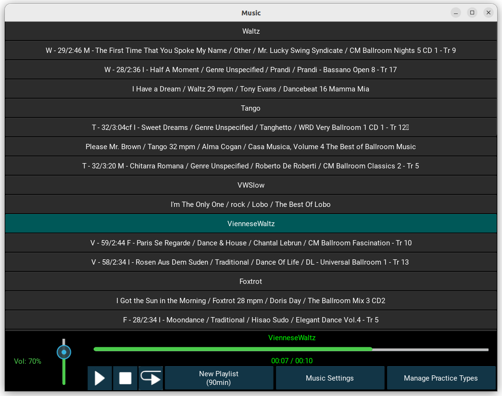
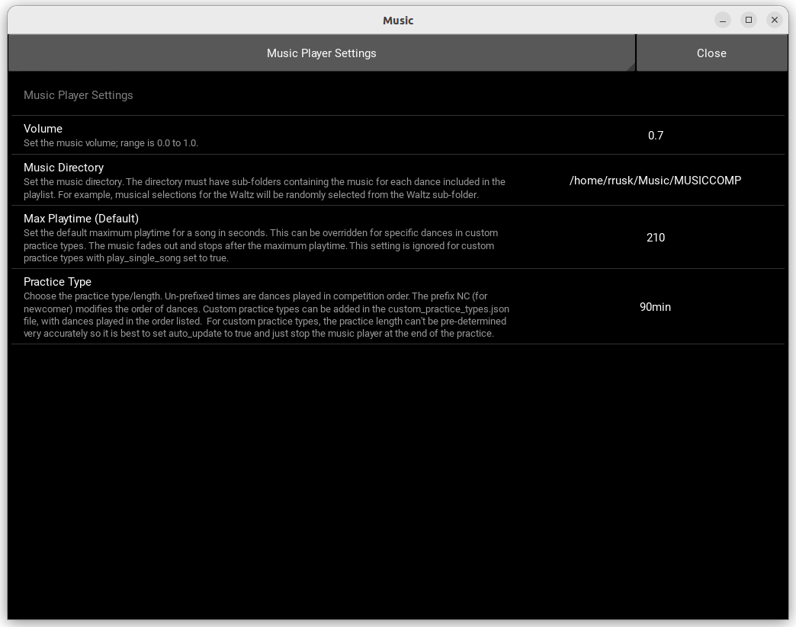
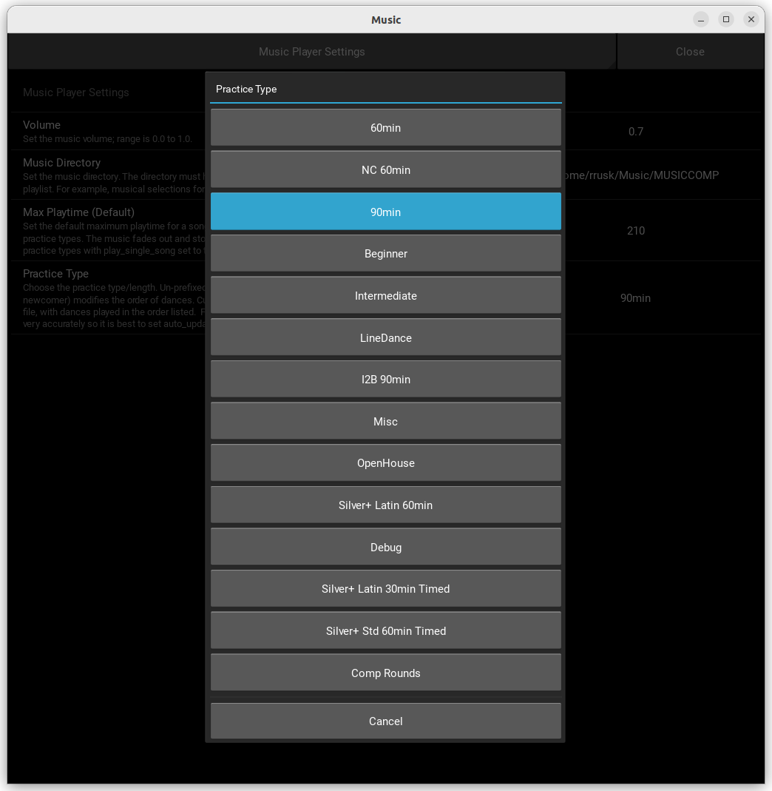

# DancePracticeMusicPlayer

**Kivy-based desktop application for managing and playing custom dance practice playlists, with optional spoken announcements.**

---

## Screenshots

Main GUI (Linux/macOS/Windows):



Settings panel:


Manage Custom Practice Types panel:


---

## Overview

**DancePracticeMusicPlayer** is a [Kivy](https://kivy.org) application written in Python that creates a music player with features useful for dance practices that use a predetermined sequence of dance types. It automatically generates a playlist and can play a spoken announcement, a silence cue, or nothing before each dance block, as specified by the practice type. The dance selections are chosen randomly from the available selections for each dance type so that each practice has a different playlist. A built-in editor supports flexible, tailored practice types without requiring direct configuration-file editing.

The application is designed to play music files (MP3, WAV, OGG, M4A and FLAC) from a selected directory. It has a user interface with buttons to play, pause, stop, and restart the music. The application also allows users to select a music directory, adjust the volume, and choose a practice length (e.g., 60 minutes, 90 minutes, etc.).

---

## Features

- **Customizable Playlists:** Generates randomized playlists based on predefined or custom dance types and lengths
- **Optional Dance Announcements:** A practice type can use a spoken announcement, a silence cue, or no introduction before each dance block
- **Per-Dance Playtime:** Override the global maximum song playtime for specific dances within a custom practice type.
- **Timed Practice Blocks:** Give a dance a length in minutes instead of a song count (e.g. 13 minutes of Waltz); songs are trimmed slightly and evenly so the block ends on time.
- **Competition Rounds:** Build finals and semi-finals with fixed-length clips, an adjustable fade at the end of each dance, gaps between dances and a warning tone between rounds.
- **Intuitive UI:** Play, pause, stop, restart controls, and a clickable, scrollable playlist
- **Real-time Progress:** Displays current song title, artist, album, genre, and playback progress with seeking capability
- **Configurable Settings:** Adjust volume, set music directory, and define a default maximum song playtime via an in-app settings panel
- **Custom Practice Types:** Use the built-in editor to define practice routines, dance sequences, song-selection rules, timed blocks, and competition rounds.
- **Platform Compatibility:** Designed to run on Linux, macOS, and Windows.

---

## Using the Player

The player is normally configured before it reaches the venue. The person running music
at a practice only needs to select the prepared practice type and control playback.

### Playback Controls

- Use **Play/Pause**, **Stop**, and **Replay** to control the current song.
- Click any song in the clickable, scrollable playlist to play it directly.
- Drag the progress bar to seek within the current song.
- Adjust the volume slider to control playback volume.

### Changing the Practice Type

Open **Music Settings** and select the required **Practice Type**. This changes the
sequence and number of songs played to the prepared definition for that practice.

---

## Installation

This application requires Python 3 and Kivy. It's highly recommended to use a virtual environment (as done in the scripts below) to manage dependencies.

### 1. Clone the Repository

- **Windows:** Download Git for Windows from [Git](https://git-scm.com/)
- **Linux/macOS:** Use your system's package manager to install Git.

Then, clone the repository:

```bash
git clone https://github.com/rrusk/DancePracticeMusicPlayer.git
cd DancePracticeMusicPlayer
```

### 2. Set Up Python Environment

Make sure you have Python and `pip` installed.
`Important:` For Windows users, it is recommended to use **Python 3.12.x** due to potential compatibility issues with Kivy on Python 3.13.x.

#### For Linux / macOS

```bash
python3 -m pip install --upgrade pip setuptools virtualenv
python3 -m venv kivy_venv
source kivy_venv/bin/activate
python -m pip install "kivy[base,media]"==2.3.0 kivy_examples==2.3.0
python -m pip install tinytag
```

#### For Windows

```bash
python -m pip install --upgrade pip setuptools virtualenv
python -m venv kivy_venv
kivy_venv\Scripts\activate
python -m pip install "kivy[base,media]" kivy_examples
python -m pip install tinytag
```

To exit the virtual environment, type `deactivate`.

### 3. Music Directory Setup

The player assumes a specific music organization within your chosen `music_dir` folder. This directory should contain sub-folders, each named after a dance type, containing the corresponding music files:

```text
music_dir/
├── ChaCha
├── Foxtrot
├── Jive
├── JSlow
├── LineDance
├── PasoDoble
├── QuickStep
├── Rumba
├── Samba
├── Tango
├── VienneseWaltz
├── VWSlow
├── Waltz
└── WCS
```

For instance, all Jive selections are in the `music_dir/Jive` folder,
all Waltz selections are in the `music_dir/Waltz` folder, etc.
You can set your `music_dir` via the "Music Settings" button in the application.

> The player searches each dance folder recursively. If subfolders are used, every music
> file beneath them must belong to the enclosing dance type; a non-Waltz song anywhere
> under `music_dir/Waltz`, for example, will still be treated as a Waltz.

Dance folder names are matched without regard to case, so `QuickStep`, `Quickstep`, and
`quickstep` behave the same on Linux, macOS, and Windows. Do not create two folders whose
names differ only in case: on a case-sensitive filesystem the player can use only one.

- Music File Requirements:
  - Musical selections are assumed to be at the correct tempo.
  - Songs shorter than 90 seconds are passed over by practice types that play a fixed number of selections per dance, since a very short track there just makes the practice end early. They are still used if a dance folder has too few longer songs, and the minimum does not apply to types that play all songs or to [Timed Practice Blocks](#timed-practice-blocks), where a short song simply means one more song in the block.
  - Songs longer than 3 minutes 30 seconds (210 seconds) will fade out and end by 3 minutes 40 seconds (adjustable via "Max Playtime" in settings), except when **Play Single Song** is enabled. This is useful for line dances, in particular, where one wants to play the entire song.
  - It is recommended that the volume of your musical selections be normalized for consistent playback.

### 4. Running the Application

After activating your virtual environment (as shown above), navigate to the `DancePracticeMusicPlayer` directory and run:

```bash
python music_player.py
```

Windows users can run the application by double-clicking on `run_music_player.bat`.

---

## Maintaining Practice Types

> Practice definitions control dance order, timing, song selection, gaps,
> announcements, and competition-round lengths. They should only be changed by someone
> familiar with the intended practice format. Venue operators should select an existing
> practice type rather than edit its definition.

Use the **Manage Practice Types** button in the player to create and maintain practice
types. The editor validates definitions before saving them and makes the resulting types
available in **Music Settings**. Directly editing the files is neither necessary nor
recommended.

### Using the Practice Type Editor

1. Click **Manage Practice Types** in the player.
2. Select an existing type to inspect or edit it, click **Copy** to use it as the basis
   for a new type, or click **New** to start with the standard template.
3. Set the name, dance order, song counts, and other required options. Some of the more
   advanced fields use small JSON objects or lists; the examples below show their expected
   format.
4. Click **Save**. The editor reports invalid values instead of saving a definition the
   player cannot use.
5. Click **Back to Player** when finished. The saved type can then be selected in
   **Music Settings**.

Built-in types are retained as defaults. Saving changes to one creates a custom override;
deleting that override restores the built-in definition. **Reset** discards unsaved form
changes, while **Delete** removes a custom type or override.

The editor stores custom definitions in `custom_practice_types.json`, using a writable
location selected by the application. This file is useful for backup and troubleshooting,
but it normally should not be edited by hand.

### Practice Type Fields

The editor provides the following settings. Fields marked as JSON accept the indicated
object or list in the editor:

- `dances` (list of strings): The sequence of dance sub-folder names to include in the playlist
- `num_selections` (integer): The default number of songs to select for each dance. This is ignored if play_all_songs is set to true
- `play_all_songs` (boolean, optional): If true, the player selects all available songs for a dance, ignoring num_selections Defaults to false
- `auto_update (boolean):` If true, the playlist will automatically generate a new set of songs and restart when it reaches the end
- `play_single_song (boolean):` If true, the player stops after playing one complete song rather than advancing. It does not change which songs are selected: the built-in `LineDance` type combines it with `play_all_songs` to list every song and play them one at a time. Stopping after each song prevents `auto_update` from regenerating the playlist.
- `randomize_playlist (boolean):` If true, songs for each dance type are selected randomly without repeating recent selections. If false, they are displayed in a fixed order and selection history is not used.
- `adjust_song_counts (boolean):` If true, the num_selections for certain dances will be adjusted based on predefined rules or dance_adjustments
- `dance_adjustments (object, optional):` A dictionary specifying custom rules for adjusting num_selections for individual dances. If adjust_song_counts is true but dance_adjustments is not specified, a default set of adjustments will be applied (e.g., to reduce the number of songs for specific dances like Paso Doble, Viennese Waltz, Jive, WCS, JSlow, and VWSlow). These rules can be direct mappings (e.g., {"1": 0, "2": 1, "default": 2}) or string formulas (e.g., "n-1", "cap_at_1")
- `dance_max_playtimes (object, optional):` A dictionary to override the global "Max Playtime" for specific dances. The keys are dance names (e.g., "VienneseWaltz") and the values are the maximum playtime in seconds.
- `order (integer, optional):` Where this type appears in the practice type list. Everything defaults to 0 and keeps its position in the file; a higher number sinks it towards the bottom, which keeps the types in regular use together at the end whatever else has been added.
- `dance_intros (object, optional):` What plays before each dance's block: `"announce"` for the spoken announcement, `"none"` for nothing, or the name of a cue in `cues/` such as `"gap_10"` for ten seconds of silence. A `"default"` key covers every dance not named individually. Without this key the announcement is used, as before.
- `dance_minutes (object, optional):` A dictionary giving specific dances a length in minutes instead of a number of songs, e.g. `{"Waltz": 13}`. See [Timed Practice Blocks](#timed-practice-blocks) below. Dances not listed keep using num_selections.
- `segments (list, optional):` Builds a sequence of competition rounds instead of a practice, replacing the dances list. See [Competition Rounds](#competition-rounds) below.

The editor labels the structured fields with **(JSON)**. Enter only the object or list for
that field, not a complete practice-type definition. For example, **Dance Max Playtimes**
can contain `{"VienneseWaltz": 120, "Jive": 150}`. The sections below give corresponding
examples for **Dance Minutes**, **Dance Intros**, and **Segments**.

### Playlist Selection History

Randomized practice types remember which songs were selected for earlier playlists and
prefer songs not selected recently. When every available song for a dance has been used,
the player starts a new cycle automatically. This history applies to ordinary practices,
timed blocks, and competition rounds; it records playlist selection rather than whether a
song was actually heard.

The **New Playlist** button creates another selection for the current practice type and
updates this history. It is primarily useful while preparing or testing practices; venue
operators normally use the playlist already generated when the practice type was selected.
There is no need to edit `play_history.json` by hand.

## Timed Practice Blocks

A practice type can spend a set amount of *time* on a dance rather than a set number of
songs — "13 minutes of Waltz" instead of "4 Waltzes". List the dance in `dance_minutes`:

```json
"Silver+ Std 60min Timed": {
    "dances": ["Waltz", "Tango", "VienneseWaltz", "Foxtrot", "QuickStep"],
    "dance_minutes": {
        "Waltz": 13, "Tango": 13, "VienneseWaltz": 8, "Foxtrot": 13, "QuickStep": 10
    },
    "dance_max_playtimes": {"VienneseWaltz": 150},
    "dance_intros": {"default": "gap_10"},
    "num_selections": 4,
    "randomize_playlist": true,
    "adjust_song_counts": false
}
```

`Silver+ Std 60min Timed` ships in `builtin_practice_types.json` and runs 57
minutes. `Silver+ Latin 30min` is deliberately **not** timed: a Latin song is
short enough that any block budget draws one song too many and then trims the
overshoot off every song in the block, which cuts routines short. It plays two
whole songs per dance instead, one for Paso Doble, and runs about 25 minutes.
A dance **not** listed in `dance_minutes` uses `num_selections` and
`dance_adjustments`, so the two styles can be mixed in one practice type. `play_all_songs` and `play_single_song`
ignore budgets entirely.

### How a block is built

1. **The block intro counts toward the budget.** The built-in timed practices use ten
   seconds of silence before each timed dance, so a 13 minute Waltz block is 13 minutes
   including that silence, not 13 minutes plus it. A custom type can instead request a
   spoken announcement or no intro.
2. **Songs are drawn one at a time** until their combined playing time reaches the budget.
   Selection is history-aware, so a block will not repeat a song the practice has already
   used. Only the songs actually kept are written to `play_history.json`.
3. **`dance_max_playtimes` still caps any one song**, and the cap is applied *before* the
   budget is worked out — a six-minute track counts as 3:40, so it cannot distort the rest
   of the block.
4. **The overshoot is shared out evenly.** Whatever the block runs over is divided by the
   number of songs and taken off each one, so each song fades a few seconds earlier than it
   otherwise would. Songs keep their own natural lengths minus that shared trim; a block is
   *not* a run of identical-length clips.

A 13 minute Waltz block, five songs, trimmed 13 seconds each:

```text
02:15  (natural 02:28)   02:18  (natural 02:31)   02:02  (natural 02:15)
03:13  (natural 03:26)   03:02  (natural 03:15)             + 10s silence = 13:00
```

### Block intros

The built-in timed practices put a few seconds of silence before each timed dance:

```json
"dance_intros": {"default": "gap_10", "PasoDoble": "announce"}
```

`Silver+ Std 60min Timed` and the blocks in `Silver+ Latin 30min` are therefore
silent. The Latin practice keeps an announcement before Paso Doble because that
dance needs the warning.

An intro counts inside a timed block's budget, so changing its type does not add to
the configured block length. Custom practice types can use `"announce"` for a spoken
announcement or `"none"` to start the music immediately.

### When it can't hit the budget exactly

- **Too few songs in the folder** — the block runs short and a warning naming the dance and
  the shortfall is printed to the console when the playlist is generated.
- **The trim would be too deep** — if sharing out the overshoot would cut more than
  `MAX_TRIM_SECONDS` (45s) from every song, the last song is dropped and the block runs
  short instead of audibly chopping the whole block.
- **A song is already short** — no song is trimmed below `MIN_SONG_PLAY_SECONDS` (60s). Its
  share of the trim is redistributed to the longer songs in the block.

Both thresholds are in `PlayerConstants` in `music_player.py`. Raising
`MIN_SONG_PLAY_SECONDS` protects short tracks more aggressively at the cost of trimming the
long ones harder.

Every generation of a timed playlist prints a per-block summary:

```text
Building timed playlist for 'Silver+ Std 60min Timed':
  Waltz: 5 songs, 13:00 of 13:00 (gap_10 10s)
  ...
  Total: 57:00
```

Note that each song's maximum playtime is now fixed when the playlist is generated rather
than being looked up during playback, so changing "Max Playtime" in settings affects the
*next* playlist rather than the current one.

---

## Competition Rounds

A practice type can build a sequence of competition rounds — finals and semi-finals with
fixed-length clips, an adjustable fade at the end of each dance, gaps between dances and a
warning tone between rounds — by defining `segments` instead of relying on the `dances`
list.

The **Comp Rounds** practice type ships with the player and runs 54:10:

```text
2:00 break (warning tone at 1:40)
FINAL #1     W T V F Q          1:30 each, 20s gaps        8:50
2:00 break
FINAL #2     W T V F Q          1:30 each, 20s gaps        8:50
2:00 break
SEMI FINAL   WW TT VV FF QQ     1:40 each, 20s gaps       19:40
2:00 break
FINAL #3     W T V F Q          1:30 each, 20s gaps        8:50
```

### How rounds differ from a practice

An ordinary practice plays songs at their own length and can introduce each dance with
an announcement, a cue, or nothing. A practice type with competition `segments` behaves
differently in four ways:

1. **Fixed-length clip, with an optional fade.** A 1:30 clip is exactly 1:30. When
   `fade_seconds` is set the fade is taken out of those 1:30 rather than added
   afterwards, so the round stays timed to the stopwatch; with no fade the clip stops
   dead.
2. **No spoken announcements.** A heat just starts. The dance name and clip length appear
   on the playlist button instead, since there is nothing spoken to identify them.
3. **Gaps are audio files.** A cue is an ordinary file in `cues/` that the player drops
   into the playlist and plays in full, so pause, seek and the progress bar all work
   normally during a gap and the gap is visible in the playlist.
4. **Songs are chosen long enough to fill the clip.** A 1:25 track cannot fill a 1:40 heat,
   so candidates shorter than the clip are passed over. If a folder has too few full-length
   tracks the longest available are used and a warning is printed.

Songs still never repeat across the whole sequence — the rounds draw from the shared play
history exactly as practice blocks do.

### Segment format

`segments` replaces the `dances` list. Each entry is either a cue or a round:

```json
"segments": [
    {"cue": "round_gap", "label": "--- 2:00 break, warning at 1:40 --- next: FINAL #1"},
    {"round": ["Waltz", "Tango", "VienneseWaltz", "Foxtrot", "QuickStep"],
     "count": 1, "clip_seconds": 90, "gap_seconds": 20, "label": "FINAL #1"}
]
```

**Cue** — `cue` names a file in `cues/` (extension omitted). `label` is the playlist button
text; a readable default is derived from the name if omitted.

**Round** — `round` lists the dances in order. `count` is how many times each is played,
consecutively, which is what makes a semi-final's heats (`"count": 2` gives W W T T …).
`clip_seconds` is the cut-off; omit it to play songs at their normal length.
`fade_seconds` fades the clip out instead of stopping it dead, and is taken
**out of** the clip rather than added to it — a 90 second clip with a 5 second
fade still runs 90 seconds, so the round keeps the length it was timed for.
`gap_seconds` inserts the `gap_<n>` cue *between* dances, with no gap after the last one
because the break between rounds follows immediately. `announce` defaults to false; set it
true to put the spoken dance announcement back in.

A bad segment is dropped with a warning rather than breaking the playlist.

### Cue audio

`cues/make_cues.sh` generates the three cues with ffmpeg:

- `gap_10.ogg` — 10s of silence before each timed-practice dance that uses a cue
  instead of a spoken announcement.
- `gap_20.ogg` — 20s of silence, between dances within a round.
- `round_gap.ogg` — 2:00 between rounds, silent except for a 5s brass fanfare starting at
  1:40, so dancers are ready when the music starts.

The warning is synthesised rather than sampled, so the file can be regenerated and
redistributed freely. To use a different warning, drop your own `round_gap.ogg` into
`cues/` — nothing in the code depends on how it was made. To add other gap lengths,
generate `cues/gap_<seconds>.ogg` and reference that number in `gap_seconds`.

Playback advances slightly before an item's natural end — `END_MARGIN` (1.0s) for music,
`CUE_END_MARGIN` (0.2s) for cues, both in `PlayerConstants`. Clips ending on their hard
cut-off are exact; only items that run to their natural end are affected.

---

## Song Metadata Cache

Every playlist generation reads the tags of the songs it considers. That is quick on a
desktop and noticeably slower on the older laptops often used at practices, so the player
caches what it reads in `song_metadata_cache.json`, keyed by file path.

Nothing needs to be done to maintain it:

- A song the player has not seen is read and cached the first time a playlist considers it.
- An entry is validated against the file's size and modification time, so re-tagged files
  (`utils/update_metadata.py`, `utils/batch_update_albums.sh`) are re-read automatically.
- The cache is written at most once per playlist, atomically, and a corrupt or missing
  cache is simply rebuilt. Deleting the file is always safe.

To move the first-read cost off the practice laptop — worth doing after adding a batch of
new music — run:

```bash
python utils/build_song_cache.py                  # add and refresh entries
python utils/build_song_cache.py --prune          # also drop entries for deleted files
python utils/build_song_cache.py --rebuild        # re-read everything
python utils/build_song_cache.py --verify         # cross-check durations against ffprobe
python utils/build_song_cache.py --check-library  # audit the library itself
```

### Checking the library after a rebuild

`--check-library` reports the things that make a dance quietly smaller or absent
rather than failing loudly, so none of them is noticeable at a practice:

- **two folders differing only in case**, where the player can read only one of
  them and the music in the other is invisible (possible on Linux only)
- a dance a practice type uses with **no folder at all**
- files with **no readable duration**, which the player skips
- folders with **too few songs** for the practice types that use them, where the
  same songs will repeat
- titles that look **double-encoded**, which is how they appear in the playlist

It exits 2 when it finds problems, so it can be used from a script. Notes about
short songs, unused folders, mojibake and folder names spelled differently from
the practice types are informational and do not affect the exit status.

Dance folder names are matched **without regard to case**, so a library built on
one platform works on the others. A folder named `quickstep`, `Quickstep` or
`QuickStep` all serve a `QuickStep` practice type, and the same applies to the
announcement and cue audio.

The matching is done by the player rather than left to the filesystem, so it
behaves the same everywhere: Windows and macOS usually ignore case themselves,
Linux does not, and macOS can be configured either way. Where a folder matching
exactly exists it is always preferred; where two folders differ only in case —
possible on a case-sensitive filesystem — the player reads one of them and
`--check-library` reports the other as invisible.

It reads the music directory from `music.ini`, so it normally needs no arguments, and it
also caches the `announce/` and `cues/` audio so they are available to any practice type
that uses them.

`--verify` is worth running occasionally. TinyTag estimates duration from file size and
bitrate when a VBR header is missing or unparsable, which can be badly wrong; an
under-reported duration makes a timed block over-run and makes competition rounds pass over
songs that were in fact long enough. A lossless remux fixes such files:
`ffmpeg -i in.mp3 -c copy out.mp3`.

---

## Measuring Startup

Set `DPMP_TIMING=1` to have the player report where its startup time goes:

```bash
DPMP_TIMING=1 python music_player.py
```

```text
[Timing] 0.543s total  kivy and tinytag imported
[Timing] 0.552s total  player widget built
[Timing] 0.568s total  app.build() complete
[Timing] 0.569s total  on_start complete (playlist generating in background)
[Timing] 0.017s        playlist generated (34 items, song cache: 34 hits, 0 misses, ...)
[Timing] 0.643s total  playlist displayed
[Timing] 0.402s        first SoundLoader.load (audio backend init)
```

The measurements go through the Kivy logger rather than the console, so they are recorded
in `~/.kivy/logs/` (`%USERPROFILE%\.kivy\logs\` on Windows) — which is the only way to get
them back from a Windows machine, where the console window is hidden at startup.

On a fast desktop nearly all of the time is the Kivy import and the audio backend, with
playlist generation a small fraction. If a practice laptop shows a different balance, the
timings say so rather than leaving it to guesswork.

---

## Tests

The tests live in [tests/](tests/) and are plain `unittest`, so they run with or without
pytest installed. From the repository root:

```bash
./run_tests.sh              # Linux/macOS
run_unit_tests.bat          # Windows
```

Either script uses pytest with coverage when it is available and falls back to
`unittest discover` when it is not. To run them directly:

```bash
python -m pytest -q                                  # all of them
python -m pytest tests/test_music_player.py -q       # one file
python -m pytest -q --cov --cov-report=term-missing  # with coverage
python -m unittest discover -s tests -t . -p "test_*.py"
```

Note that **the tests need a display**. Kivy opens a window while they run: the editor
tests build real widgets and fail without a window provider, so there is no headless mode.

`tests/conftest.py` puts the repository root on `sys.path`, since the application modules
are not a package. Coverage settings live in `.coveragerc` and measure only the modules the
player runs, so the total does not move when an unrelated script is added.

---

## Code Architecture

The application's core logic is primarily contained within two main classes: `MusicApp` and `MusicPlayer`.

1 `MusicApp` **(kivy.app.App)**:

- The entry point of the Kivy application.
- Manages application-level configurations, settings loading, and initial setup.
- Handles default configuration values and changes to user settings.
- Applies platform-specific fixes (e.g., for Windows console visibility and GStreamer priming).

2 `MusicPlayer` **(kivy.uix.boxlayout.BoxLayout):**

- The main UI widget responsible for all music player functionality.
- **UI Management:** Builds and manages the layout, including the scrollable playlist, control buttons, volume slider, and progress bar.
- **Playlist Logic:** Generates, updates, and manages the playback of randomized playlists based on selected dance types.
- **Sound Control:** Handles loading, playing, pausing, stopping, and seeking within audio files using `kivy.core.audio.SoundLoader`.
- **Settings Integration:** Interacts with the application settings to configure music directory, volume, max playtime, and practice type.
- **Custom Practice Types:** Loads and integrates custom practice definitions from `custom_practice_types.json`.

### Key Methods Overview

Some critical methods within the MusicPlayer class include:

- `play_sound():` Loads and plays the current song, handling sound state and progress updates.
- `pause_sound():` Pauses the music and updates the play/pause icon.
- `stop_sound():` Stops playback, unloads the sound, and resets player state.
- `restart_sound():` Restarts the current song from the beginning.
- `update_progress():` Called periodically to update the UI progress bar and manage song transitions (fade out, next song).
- `update_playlist(directory):` Regenerates the entire playlist based on the current music directory and selected dance types.
- `_display_playlist_buttons():` Renders the current playlist as clickable buttons in the UI.
- `set_practice_type(text):` Updates the internal dance lists and playlist generation logic based on the chosen practice type, including applying randomize_playlist, adjust_song_counts, and dance_adjustments.
- `load_custom_practice_types():` Reads custom practice types from `custom_practice_types.json`.
- `merge_custom_practice_types():` Integrates loaded custom practice types into the application's settings and dance mappings.

### Configuration

The application uses a `music.ini` file for persistent configuration (music directory, volume, maximum song playtime, and practice type). This file is automatically created on first run and can be modified via the "Music Settings" button. In a writable source checkout it is kept beside the application; an installed or read-only copy uses the platform's per-user application-data directory instead.

### Practice Dances

The `practice_dances` property within MusicPlayer defines the default dance sequences for different practice lengths (e.g., "60min", "90min"). This data is extended by the `custom_practice_types.json` file, allowing users to define their own dance lists and associated song selection rules.

## License

This project is licensed under the MIT License. See `LICENSE` for details.

## Contributing

Feel free to fork the repository and submit pull requests for new features or bug fixes.
